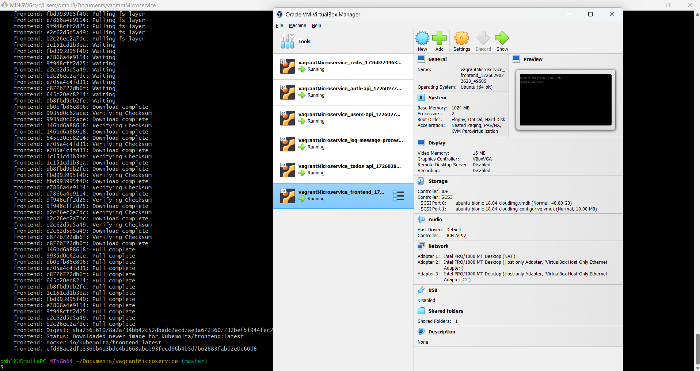
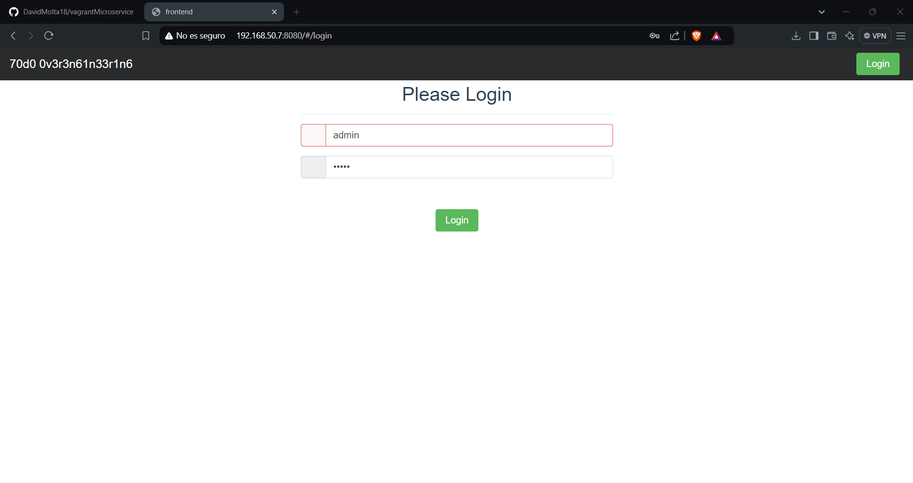
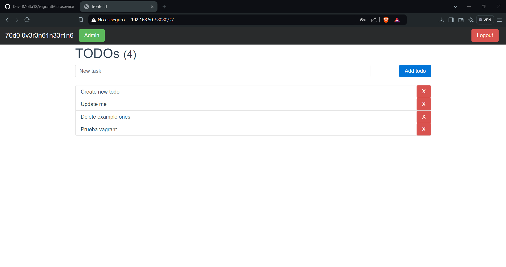
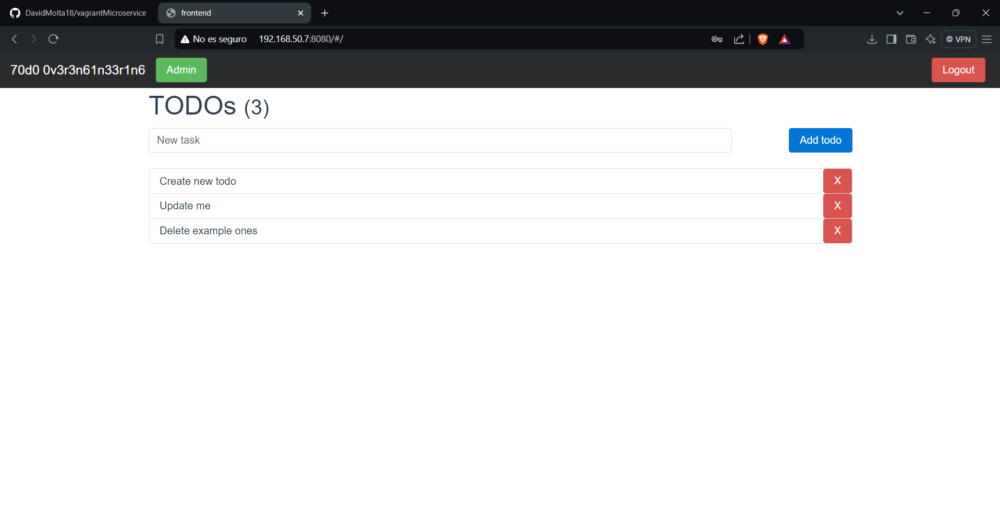

# 📋 Microservices-Based Application with Vagrant

This project deploys a microservices-based application using **Vagrant** to manage multiple virtual machines (VMs). Each VM hosts a specific microservice containerized with **Docker**. The project covers the implementation of various APIs and a frontend, along with **Redis** as middleware. 

## 🛠️ Technologies Used

- **Vagrant**: To automate and manage the setup of multiple VMs.
- **Docker**: To containerize each microservice.
- **Golang**: Used for the development of the **Auth API**.
- **Node.js**: Used for the **Frontend** and the **TODOs API**.
- **Python**: Used for the **Log Message Processor**.
- **Java (Spring Boot)**: Used for the **Users API**.
- **Redis**: Middleware for communication between services.

## 🔨 Project Setup and Configuration

The Vagrantfile defines five VMs, each for a different microservice, plus a VM for **Redis**. Each VM runs on Ubuntu and provisions Docker containers to run the respective microservices. Below is a summary of the VMs and their configuration.

### 🧑‍💻 Auth API VM

- **OS**: Ubuntu (bionic64)
- **IP**: `192.168.50.2`
- **Docker Container**: Runs **Auth API** in Golang.
- **Command to start container**:

```sh
docker run -d -p 8000:8000 --name auth-api   -e AUTH_API_PORT=8000   -e USERS_API_ADDRESS=http://192.168.50.3:8083   -e JWT_SECRET=PRFT   kubemolta/auth-api
```

### 👤 Users API VM

- **OS**: Ubuntu (bionic64)
- **IP**: `192.168.50.3`
- **Docker Container**: Runs **Users API** in Java (Spring Boot).
- **Command to start container**:

```sh
docker run -d -p 8083:8083 --name users-api   -e JWT_SECRET=PRFT   -e SERVER_PORT=8083   kubemolta/users-api
```

### 📝 TODOs API VM

- **OS**: Ubuntu (bionic64)
- **IP**: `192.168.50.6`
- **Docker Container**: Runs **TODOs API** in Node.js.
- **Command to start container**:

```sh
docker run -d -p 8082:8082 --name todos-api   -e TODO_API_PORT=8082   -e JWT_SECRET=PRFT   -e REDIS_HOST=192.168.50.5   -e REDIS_PORT=6379   -e REDIS_CHANNEL=log_channel   kubemolta/todos-api
```

### 💬 Log Message Processor VM

- **OS**: Ubuntu (bionic64)
- **IP**: `192.168.50.4`
- **Docker Container**: Runs **Log Message Processor** in Python, communicating with Redis.
- **Command to start container**:

```sh
docker run -d --name log-message-processor   -e REDIS_HOST=192.168.50.5   -e REDIS_PORT=6379   -e REDIS_CHANNEL=log_channel   kubemolta/log-message-processor
```

### 🖥️ Frontend VM

- **OS**: Ubuntu (bionic64)
- **IP**: `192.168.50.7`
- **Docker Container**: Runs the **Frontend** in Node.js.
- **Command to start container**:

```sh
docker run -d -p 8080:8080 --name frontend   -e PORT=8080   -e AUTH_API_ADDRESS=http://192.168.50.2:8000   -e TODOS_API_ADDRESS=http://192.168.50.6:8082   kubemolta/frontend
```

### 🗄️ Redis VM

- **OS**: Ubuntu (bionic64)
- **IP**: `192.168.50.5`
- **Docker Container**: Runs **Redis** as middleware.
- **Command to start container**:

```sh
docker run -d --name redis -p 6379:6379 redis:7.0
```

## 🚀 Project Execution

To run the project, use the following command inside the folder where the `Vagrantfile` is located:

```
vagrant up
```

This will bring up all the VMs, set up Docker containers for each microservice, and configure the necessary network settings for communication between them.

## 🌐 Summary of Services and Ports

- **Auth API**: `http://192.168.50.2:8000`
- **Users API**: `http://192.168.50.3:8083`
- **TODOs API**: `http://192.168.50.6:8082`
- **Frontend**: `http://192.168.50.7:8080`
- **Redis**: Running on `192.168.50.5:6379`

## 📚 Conclusion

This project demonstrates how to manage and deploy a microservices-based architecture using **Vagrant** to create isolated virtual environments, each running its respective Docker container. This setup ensures seamless communication between the services and provides a scalable solution for testing, development, or production environments. Using **Docker** inside VMs gives flexibility to configure, maintain, and update the services independently.

## Functional proves






